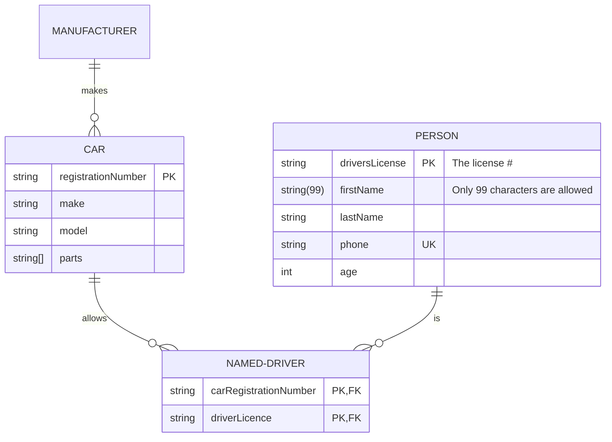
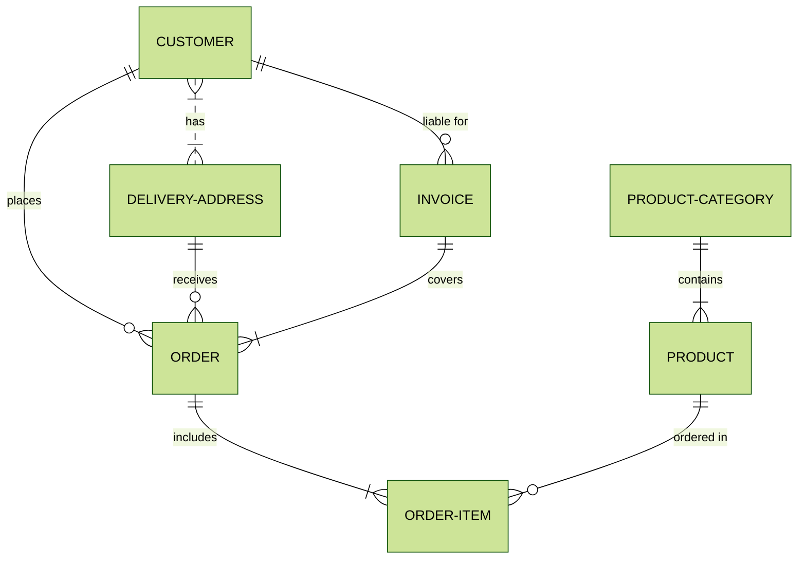

# Демонстрация возможностей

Используется [маркдаун](https://commonmark.org/help/) и HTML для разметки текста и [Mermaid](https://mermaid.js.org/syntax/examples.html) для диаграмм

Ссылка на [якорь заголовка](#якорь), [якорь в тексте](#якорь_в_ексте)

## Цитаты

> Не подобает мужам благородным браниться, как простолюдинам.
>
> — Иван Грозный

## Подсветка синтаксиса

```js
console.log("Подсветка синтаксиса JS");
```

```sql
--Начало транзакции
BEGIN;

-- Инструкция обновления данных
UPDATE people
SET name = 'Ivan'
WHERE id = 1;

-- Инструкция обновления данных
UPDATE people
SET lastname = 'Gray'
WHERE id = 10;

--Конец транзакции
COMMIT;
```

## Картинки


## Диаграммы



---



## Якорь

<p id="якорь_в_ексте">Якорь в тексте</p>

<details>
<summary>Lorem ipsum</summary>
Lorem ipsum odor amet, consectetuer adipiscing elit. Natoque taciti consequat bibendum vel, sagittis lobortis sem. Adipiscing curabitur rhoncus tempor; in imperdiet nisi. Magna maximus felis feugiat curae nulla aliquam consectetur arcu. Lacinia maximus est molestie augue duis auctor quam ligula. Eleifend primis pretium litora porttitor quis luctus. Fringilla primis metus proin facilisi congue. Fusce class in nisi viverra vehicula laoreet cursus. Nunc habitasse posuere consequat etiam nostra donec.

Suspendisse iaculis fermentum ut enim cubilia ultricies blandit nisi. Gravida turpis scelerisque tristique facilisis urna porta mattis. Maximus vehicula gravida dui sit est libero fusce sagittis tristique. Donec facilisis fames dictumst inceptos dui. Suscipit sodales natoque lectus vivamus diam. Magna nec et augue adipiscing malesuada tempor nascetur tellus facilisi. Montes parturient porttitor morbi nam, morbi sit. Enim scelerisque vestibulum turpis augue a rutrum. Nisl urna euismod tempus quis purus tellus purus.

Senectus ultrices porttitor ante maecenas ultrices. Suscipit mi justo; suscipit gravida non dapibus scelerisque. Gravida faucibus est porttitor lacus ante pharetra aliquet ipsum. Rhoncus tempor penatibus curabitur magnis, conubia aenean nec amet. Curabitur cras parturient nascetur a est. Habitant primis elit congue pretium pellentesque odio turpis magna.

Mollis arcu neque lectus enim torquent arcu fusce. Platea fermentum aenean gravida facilisis curae elementum aptent turpis. Morbi lacinia mattis amet etiam; vitae viverra. Tristique ultricies sollicitudin ligula placerat lacus eu dictum. Tortor etiam molestie nisl libero; massa sapien. Litora platea amet vulputate nisl augue montes.

Efficitur nam ultrices risus felis fusce nulla egestas consequat est. Dis elit volutpat dis nulla tempor pulvinar. Suscipit erat montes nibh auctor eu habitant ipsum. Sapien venenatis elit pretium risus neque natoque. Non montes facilisis urna per integer enim mauris. Vivamus magna ultricies nam montes sagittis montes eu nulla. Cubilia dui duis libero cras vestibulum fringilla torquent platea himenaeos.
</details>
